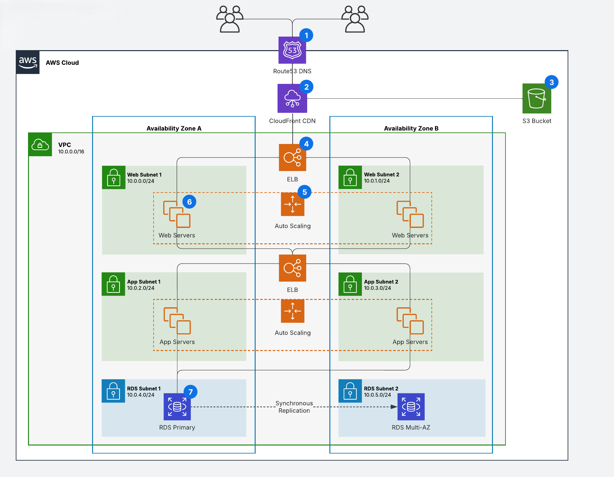

# 🏗️ AWS Scalable Web Application Architecture

This project outlines a **highly available**, **scalable**, and **fault-tolerant** web application architecture deployed on **Amazon Web Services (AWS)**. The infrastructure is designed to support dynamic web applications with auto-scaling, load balancing, and resilient database support.

---

## 🧰 Architecture Components

### 1. Route 53 (DNS)
- Domain Name System (DNS) service to route user requests to the application.
- Provides global traffic distribution and failover.

### 2. Amazon CloudFront (CDN)
- Delivers content with low latency and high transfer speeds.
- Integrates with S3 for static content and web servers for dynamic content.

### 3. Amazon S3
- Used for storing static assets (images, CSS, JavaScript files).

### 4. Elastic Load Balancers (ELBs)
- Distribute incoming traffic to web and app servers across multiple availability zones.
- Ensures high availability and fault tolerance.

### 5. Auto Scaling Groups
- Automatically adjusts the number of EC2 instances in the web and app tiers.
- Maintains performance and minimizes cost.

### 6. Web Tier
- Hosted in two subnets (Web Subnet 1 & 2) across Availability Zones A & B.
- Handles HTTP requests and forwards logic-heavy tasks to the app tier.

### 7. App Tier
- Deployed in App Subnet 1 & 2 for redundancy.
- Executes business logic and interacts with the database layer.

### 8. Database Tier (Amazon RDS)
- Primary DB instance in RDS Subnet 1.
- Multi-AZ deployment with synchronous replication to a standby instance in RDS Subnet 2 for disaster recovery.

---

## 🛡️ High Availability & Fault Tolerance

- **Multi-AZ deployment**: Web, App, and RDS tiers are spread across two Availability Zones.
- **Auto Scaling**: Automatically replaces unhealthy instances and scales based on demand.
- **Load Balancers**: Provide seamless traffic distribution and health checks.

---

## 🚀 Deployment Overview

- VPC: `10.0.0.0/16`
- Subnets:
  - Web Subnets: `10.0.0.0/24`, `10.0.1.0/24`
  - App Subnets: `10.0.2.0/24`, `10.0.3.0/24`
  - RDS Subnets: `10.0.4.0/24`, `10.0.5.0/24`
- Deployment is managed using Terraform/CloudFormation (optional - to be added in future versions).

---

## 🔐 Security Features

- Subnets are segmented for better network control.
- Security Groups and NACLs restrict traffic at both instance and subnet levels.
- RDS is deployed in private subnets with no direct internet access.

---

## 📁 Project Structure
├── architecture-diagram.png # AWS Architecture Diagram
├── README.md # Project Documentation
├── templates/ # (Coming soon) IaC Templates
│ ├── terraform/
│ └── cloudformation/

---

## 📌 Future Enhancements

- Add CI/CD pipeline with AWS CodePipeline.
- Integrate with AWS WAF and Shield for added security.
- Add monitoring via Amazon CloudWatch.
- Provide Terraform and CloudFormation scripts for deployment.

---

## 📄 License

This project is licensed under the [MIT License](LICENSE).
